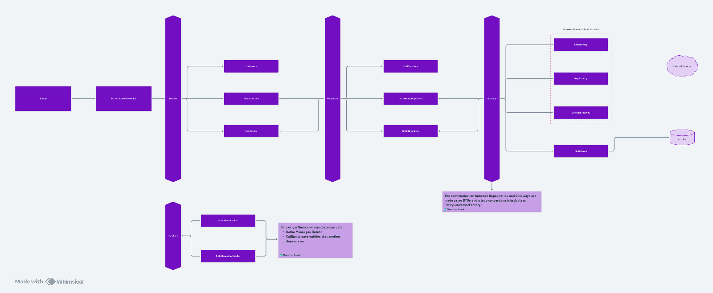

# salesforce

A new Flutter project.

## Project Structure

```
lib/
    ├── data/           # Data access layer and communication abstractions
    │ ├── DTO/              # Mappers for API/DB/Kafka request/responses
    │ ├── factory/          # Entity Conversor Factory
    │ ├── gateway/          # Central Communication Interfaces and Isolates
    │ └── repository/       # Data sources abstraction and implementation
    │   ├── api/                # REST API
    │   ├── kafka/              # Apache Kafka
    │   └── local/              # SQLite
    ├── domain/         # Business logic and application rules
    │   ├── enum/           
    │   ├── model/          
    │   └── transform/      # Transforms RawJson to application model expectation JSON
    ├── module/         # Application modules and services
    │   ├── handler/        # Event/message handlers (Kafka/entityDependants)
    │   ├── service/        
    │   └── updater/        # Background/scheduled update modules
    ├── presentation/   # UI layer components
    │   ├── dialogs/        
    │   ├── screen/         
    │   ├── state/      
    │   └── widget/         
    ├── util/           # Utilities and helpers
    ├── globals.dart    # App-wide constants
    ├── main.dart       
    └── setup.dart      # Initialization Process
```

## Code Workflow
Here follows a breif explanation of how the base structure of the code works, from the presentation Layer until the data Layer.

